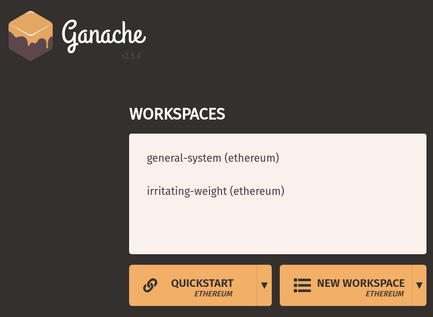
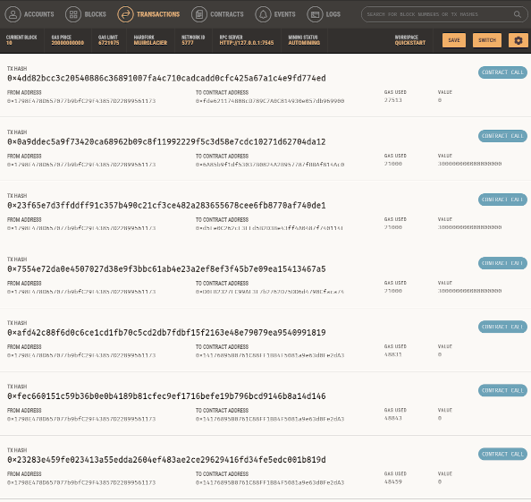

# co2event
**GHG accounting and decompensation using DLT based Identity Management concepts (ID-Ideal AP8) in accordance to ISO14064-3. Usage domain: E-Mobility, Car-Charging**

[](https://co2offset.io/badge.html?host=co2event)

The ISO 14064 standard is part of the ISO 14000 series of International Standards for environmental management. The ISO 14064 standard provides governments, businesses, regions and other organisations with a complementary set of tools for programs to quantify, monitor, report and verify greenhouse gas emissions. The ISO 14064 standard supports organisations to participate in both regulated and voluntary programs such as emissions trading schemes and public reporting using a globally recognised standard.

## Business Case

E-mobility allows us to move away from CO2-emitting fossil fuels towards energy supplied from electrical power sources which are, in turn, charged through the electricity grid. By decarbonizing the transport sector, electromobility will create a cleaner, healthier and more affordable future for everyone.

However taking electricity from the grid is not CO2 neutral due to the grid losses, even if 100% renewable generation is used. Further it changes over time as the generation mix and the distance between generation and consumption changes.

### IF we
ensure a net Zero GHG emission for e-Mobility charging
- complexity of reporting gets lowered (fleet sum = Zero Emission)
- market abitrage for compensation could be leveraged
- cost of environmental management gets lowered   

## Definitions
| Role      | Description |
| ----------- | ----------- |
| Emitter      | Something like a direct or indirect Metering device that might that knows that some Entity caused a certain CO2 emission |
| Entity   | Actual real world entity (human beeing?) that is responsible for the CO2 emission event. |
| Compensator | Some party/organization providing compensation of CO2 |

## Requirements
- NPM and Node JS (V12 or greater)
- Truffle Suite [Website](https://www.trufflesuite.com/)
- Ganache [Website](https://www.trufflesuite.com/ganache)

## Usage
Clone [GIT repository](https://github.com/energychain/co2event) and do basic dependency installation

```shell
git clone https://github.com/energychain/co2event.git
cd co2event
npm install
npm install -g truffle
npm run build
npm test
```

Do not forget to start/run Ganache :)

### Compiling Smart-Contracts
```shell
npm run build
```

### Interact with SmartContract (Deployed)
```shell
truffle console
let instance = await CO2Accounting.deployed();
instance.totalSupply();
```

### Test Smart Contract
```shell
npm test
```


## Usecase EV-Charging (GER)


0. **Deployment des Smart Contracts und Rollenzuweisung der Teilnehmer über Wallet Adressen**
- Messstellenbetreiber -> Emitter (Recht Burnable Token auf fremden Adressen zu emitieren)
- Nutzer/Person -> Entity
- Plant for the Planet -> Compensator (Recht Burnable Token auf fremden Adressen zu vernichten)

1. **Nutzer führt E-Auto Beladung über 5 kWh durch**
- Emitter 'emittiert' das CO2 Äquivalent der 5 kWh Beladung von 175g in die Wallet der Entity als Burnable Token

2. **Nutzer will die Beladung Kompensieren**
- Prüfvorgang ob Kompensation möglich ist

3. **Planet for the Planet kompensiert für Nutzer**
- Compensator vernichtet die 175 Burnable Token der Entity

### DApp

Prepare your environement

`Start Ganache` and select Quickstart


```shell
npm run migrate
```

Validate Results:
```
Summary
=======
> Total deployments:   2
> Final cost:          0.05141418 ETH
```

Switch in Ganache to Transactions panel:


Finally start Development HTTP Server:
`cd app && npm run dev`

#### [Use Cases](./docs/usecases_dapp.md)

Implemented Use Cases with sample UI


## Maintainer / Imprint
<addr>
STROMDAO GmbH  <br/>
Gerhard Weiser Ring 29  <br/>
69256 Mauer  <br/>
Germany  <br/>
  <br/>
+49 6226 968 009 0  <br/>
  <br/>
kontakt@stromdao.com  <br/>
  <br/>
Handelsregister: HRB 728691 (Amtsgericht Mannheim)
</addr>


## LICENSE
Apache-2.0
