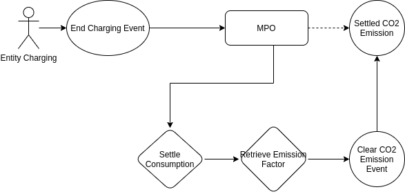
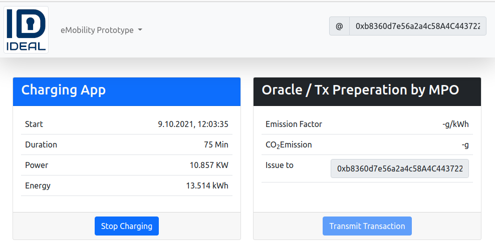
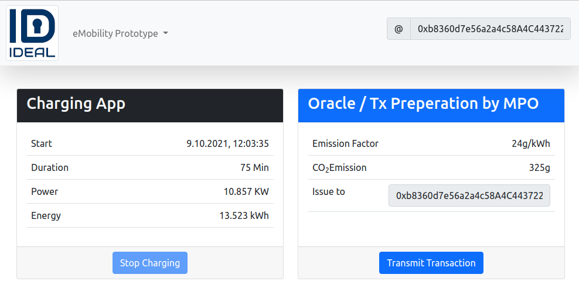
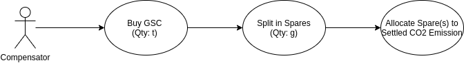
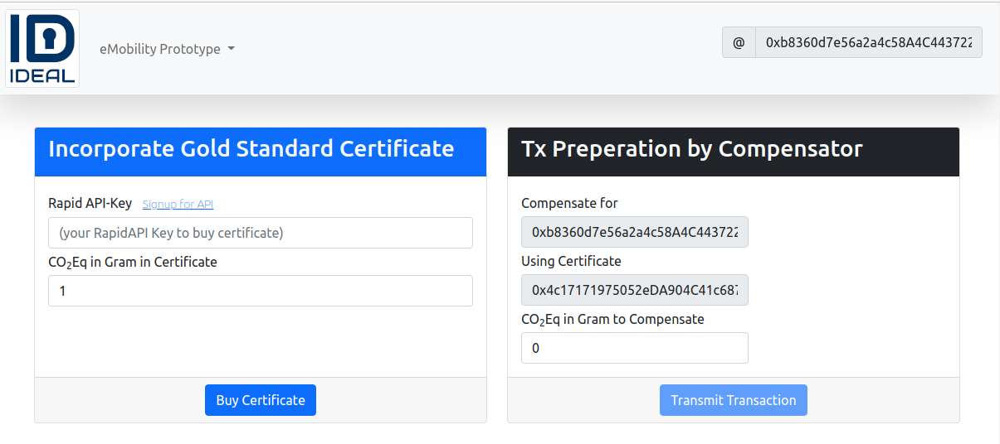

# DApp Use Cases

## UC1: Settlement

Entity (User) ends a charging session (by pressing the Stop button). MPO (Meter Point Operator) has final consumption and is able to retrieve the latest CO2 emission factor.

  

Using CO2 emission factor for this session the settled CO2 will be transfered by calling the `emission` method of the [CO2Accounting Contract](../contracts/CO2Accounting.sol). This transaction needs to be signed by a pre approved `EMITTER_ROLE`.

In the DApp this transaction is issued using the `Transmit Transaction` button.

  

After the transaction is commited the **Consensus / Ledger** Information should contain the right emitted CO2eq for the user.

## UC2: Allocation of Compensation

Compensator gets an CO2 Offset activity audited. In accordance to the rules of Gold Standard the granularity of those activities is in Tones.

**NOTE:** This implementation uses an online service at RapidAPI to do the quantity transformation from tones to grams. While keeping the integrity of the Gold-Standard Credit.

Pressing the `Buy Certificate` button, a new certificate (Gold Standard Credit, VER) will be bought via an API call. This certificate gets available at an internal ID represented in the `Using Certificate` field.

This certificate field could now be transfered by the Compensator in total or in spares to an Entity. 
